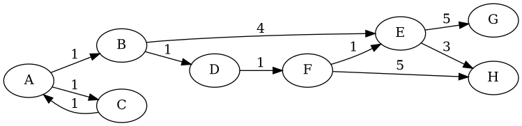

## Exploration
For questions 1-3, consider the following graph:
```
      1
     /|\
    4 | 6--2
     \|/  / 
      5--3
```

1. a. Draw the adjacency list representation of the above graph.    
   b. Draw the adjacency matrix representation of the graph.

2. Graphs can have directed or undirected edges (a useful analogy for directed edges is one-way roads).   
a. Draw the above graph with directed edges. Assume all of the edges are directed from the smaller number to the larger.  
b. What is the adjacency list representation of your directed graph?   
c. What is the adjacency matrix representation of your directed graph?
   
3. Graphs can also have weighted edges (e.g., distance).   
a. Draw the undirected graph above with weighted edges. Use the sum of the values of each edge's two vertices as its weight.   
b. What is the adjacency list representation of your weighted graph?  
   c. What is the adjacency matrix representation of your weighted graph?
   
The next two questions asks you to find the path from A to H on the below graph. You should ignore the edge weights for this section of the worksheet. When deciding which node to visit next, _if they are otherwise tied, go by alphabetical order_.


For each graph search algorithm, fill out a table like the one below. The Frontier column is the list of nodes (in order) to explore next; the Path column is the path from A to the current node; the Visited column are all the nodes that have been visited; and the New Neighbors column are the nodes to be added to the frontier. The table currently shows the first two rows of depth-first search.

Two slight changes from the textbook. First, our table will show *paths* instead of *nodes*, to make it more obvious whether you are following the algorithm correctly. Second, we will *not* rule out new neighbors until they are removed from the frontier. This means that the path ACA will be added to the frontier, but will be skipped when we select it to be explored. This is in contrast to the pseudocode in the textbook, where ACA would be filtered out when we consider what to add to the frontier. This should count as a step in your table, leaving ACA in the Path column, but with no changes to the Visited column and no New Neighbors to add to the frontier.

(You can either create a table elsewhere and submit a picture/screenshot, do this directly in this document; if you do the latter, note that the pipes (`|`) do not have to align. You should add more rows if necessary.)

| Step | Frontier | Path | Visited | New Neighbors |
| ---- | -------- | ---- | ------- | ------------- |
| 1    | A        | A    | A       | AB, AC        |
| 2    | AB, AC   | AB   | A, B    | ABD, ABE      |
| 3    |          |      |         |               |
| 4    |          |      |         |               |
| 5    |          |      |         |               |
| 6    |          |      |         |               |
| 7    |          |      |         |               |
| 8    |          |      |         |               |

4. Create a copy of the table and fill it out for depth-first search.

5. Create a copy of the table and fill it out for breadth-first search.

6. What is the space and time complexity of depth-first search? Justify your answer. (Note that the internet will give a number of different answers here. Your answer should reflect the pseudocode and representations used in our textbook)

7. What is the space and time complexity of breadth-first search? Justify your answer. (Note that the internet will give a number of different answers here. Your answer should reflect the pseudocode and representations used in our textbook)

## Challenge

1. Social networks (like Facebook, Instagram, Snapchat, etc.) are often represented as graphs. Pick a social network. How would you represent it as a graph? What would nodes represent? What about edges? Would the graph be directed or undirected? Weighted or unweighted? Justify your decisions.

2. Why does neither depth-first search nor breadth-first search find the lowest cost path from A to H?

3. One algorithm to find the lowest cost path is called *uniform cost search* (aka Dijkstra's algorithm). The idea is that as we visit each node, we keep track of the total cost of the path so far, and always pick the path with the lowest cost. Using the same table as before, we now also indicate the path cost in parenthesis. The first two rows have been filled out as an example.

    | Step |    Frontier    | Path | Visited |   New Neighbors  |
    | ---- | -------------- | ---- | ------- | ---------------- |
    | 1    | A (0)          | A    | A       | AB (1), AC (1)   |
    | 2    | AB (1), AC (1) | AB   | A, B    | ABD (2), ABE (5) |
    | 3    |                |      |         |                  |
    | 4    |                |      |         |                  |
    | 5    |                |      |         |                  |
    | 6    |                |      |         |                  |
    | 7    |                |      |         |                  |
    | 8    |                |      |         |                  |

    Fill out the remainder of the table for uniform cost search.
   
4.  Fill in the blank: If stacks are to depth-first search as queues are to breadth-first search, ____ are to uniform cost search. Explain your answer.
